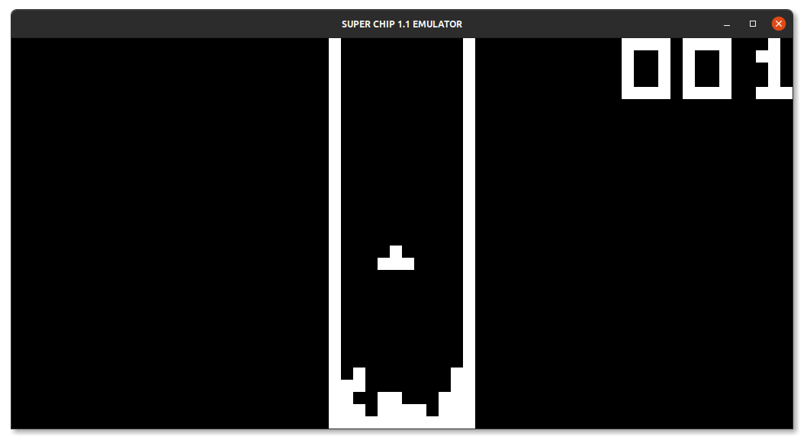
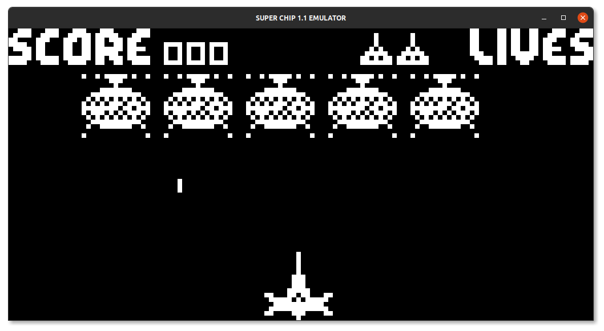

# CHIP-8 Emulator in C

Here lies a simple CHIP-8 emulator I built to learn about emulators 
and generally how processors work. I took it upon myself to also implement 
the Super Chip v1.1 extensions so this emulator can run super chip games
as well. Sound has also been emulated though it is a bit buggy.

## Compilation and running

This is a cmake project and requires `cmake >=3.16`. You will also need 
to have the SDL 2 library installed on your system to build. To build (at least on linux) 
run the following commands at the root directory

```shell
cmake .
make
```

I haven't tested it on other platforms and you would have to figure out 
the best way to compile on your system. Once compilation is complete you 
can run the binary passing your desired chip 8 ROM as argument. You can get 
roms [here](https://www.zophar.net/pdroms/chip8/super-chip-games-pack.html)

```shell
./chip8 tetris.ch8
```




Any contributions are welcome.